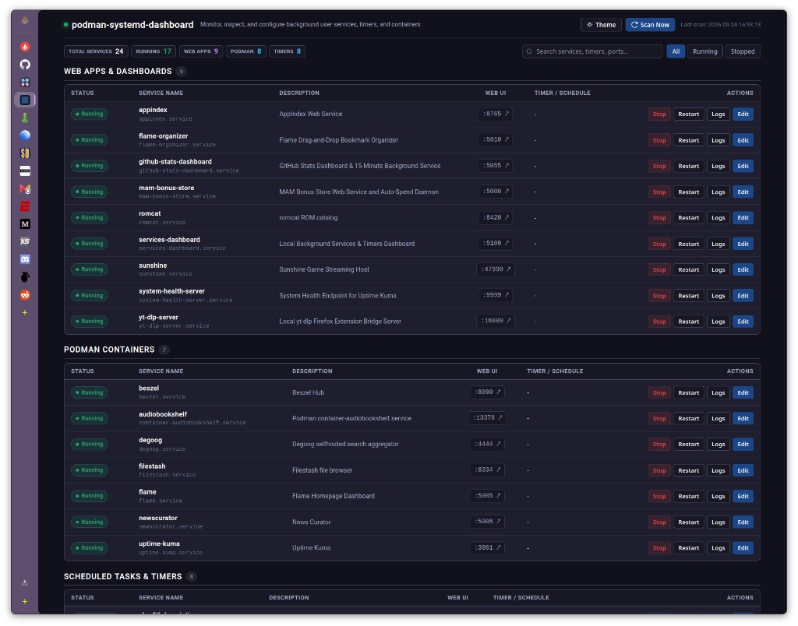

# podman-systemd-dashboard

A lightweight, high-performance web dashboard for monitoring, inspecting, and managing rootless Podman Quadlet containers, user-level systemd services, and scheduled timers.



## Overview

`podman-systemd-dashboard` provides a single pane of glass for Linux user services and rootless containers. Built with FastAPI and vanilla JavaScript, it runs with zero heavyweight frontend build steps and minimal memory overhead.

## Key Features

- **Podman Quadlet Discovery**: Automatically scans and detects rootless Podman containers defined in `~/.config/containers/systemd/`.
- **Systemd User Units & Timers**: Discovers and monitors background user services (`~/.config/systemd/user/`) and associated `.timer` schedules with next-trigger timing.
- **Port & Web App Detection**: Inspects container configs and unit files to detect published ports, providing direct launch links for self-hosted web applications.
- **Service Controls**: Start, stop, and restart user services directly from the browser UI.
- **Built-in Unit File Editor**: Safely view and edit `.service` and `.container` unit files in-browser with automatic backup creation (`.bak`) before saving.
- **Live Journalctl Logs**: View recent service logs in real time with line-count controls and auto-refresh.
- **Instant Search & Quick Filters**: Search by service name, description, or port; filter by status (All, Running, Stopped) or category.
- **Theme Customization**: Includes multiple modern dark and light color themes, plus a built-in theme builder with real-time preview and browser persistence.
- **Compact & Responsive UI**: Dense layout optimized for quick status overviews and minimal screen footprint.
- **Zero-Terminal Self-Updater**: In-app one-click self-updater supporting both Git and standalone installations with automatic server restart.

## Requirements

- Linux with `systemd` (user session)
- Python 3.10+
- Podman (optional, for Quadlet container discovery)

Python dependencies:
```bash
pip install -r requirements.txt
```

## Quick Start

### 1. Clone and Install

```bash
git clone https://github.com/PlasmaDrifter/podman-systemd-dashboard.git
cd podman-systemd-dashboard
pip install -r requirements.txt
```

### 2. Run the Dashboard

```bash
python3 app.py
```

The web interface will be available at:
`http://localhost:5100`

### 3. Run as a Systemd User Service

To run automatically in the background on system boot:

1. Copy the unit file to your user systemd directory:
   ```bash
   mkdir -p ~/.config/systemd/user/
   cp podman-systemd-dashboard.service ~/.config/systemd/user/
   ```

2. Adjust the `WorkingDirectory` and `ExecStart` paths in `~/.config/systemd/user/podman-systemd-dashboard.service` if your installation path differs.

3. Reload and enable the service:
   ```bash
   systemctl --user daemon-reload
   systemctl --user enable --now podman-systemd-dashboard.service
   ```

4. Check the service status:
   ```bash
   systemctl --user status podman-systemd-dashboard.service
   ```

## Configuration & Architecture

- **Backend**: FastAPI with Uvicorn, querying `systemctl --user` and reading unit files directly.
- **Frontend**: Single-page application using modern CSS custom properties and native DOM manipulation.
- **Port Mapping**: Discovers ports via `PublishPort=` in Quadlets or regex matching in Exec directives, supplemented by known port defaults in `scanner.py`.

## License

MIT License.
